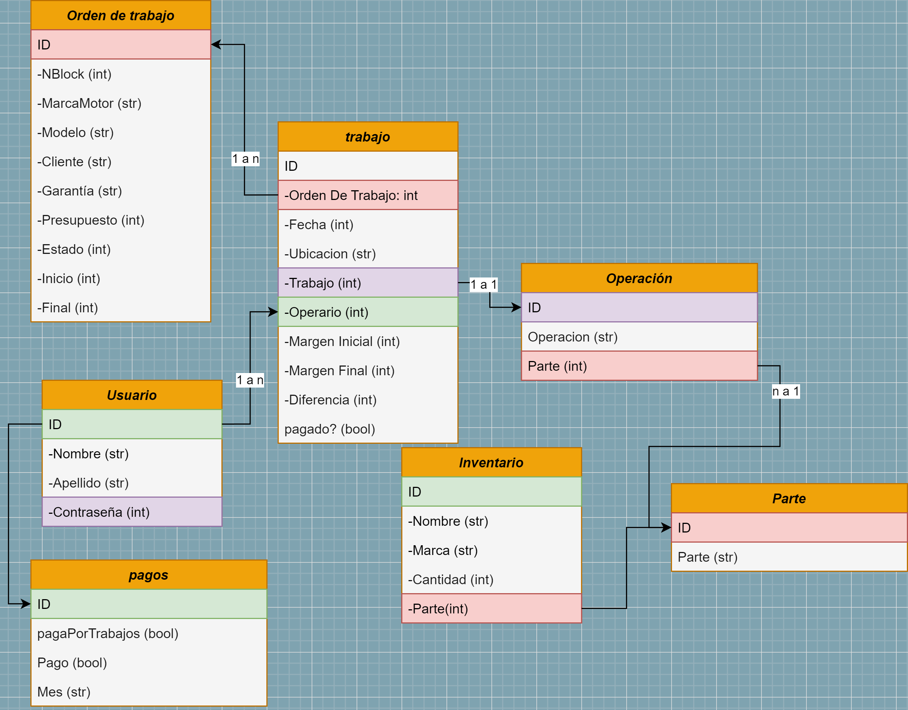

# Trabajo-Nro1

Aplicación web para una rectificadora de motores. Agiliza el trabajo de los operarios y hace remitos y facturas.

## Imágenes:

### En este apartado mostraré diferentes imágenes que esclarecerán el proyecto:

### Diagrama de clases Base de datos:

Este diagrama muestra como es la estructura de la base de datos, mostrando que:

- Una pieza puede tener muchas operaciones
- Un trabajo contiene solo una operacion
- Una orden de trabajo puede contener muchos trabajos
- Un usuario puede tener muchos trabajos
- Un usuario contiene solo un pago.
- Un inventario puede tener muchas partes.

